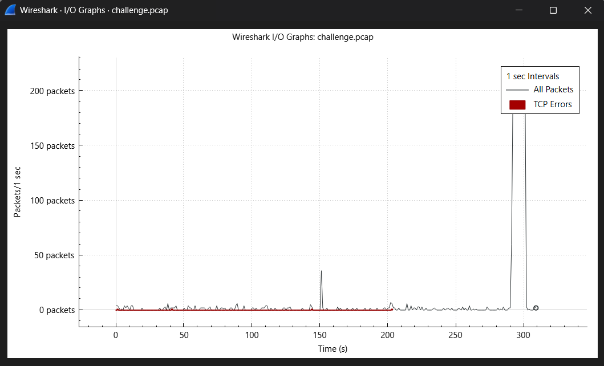
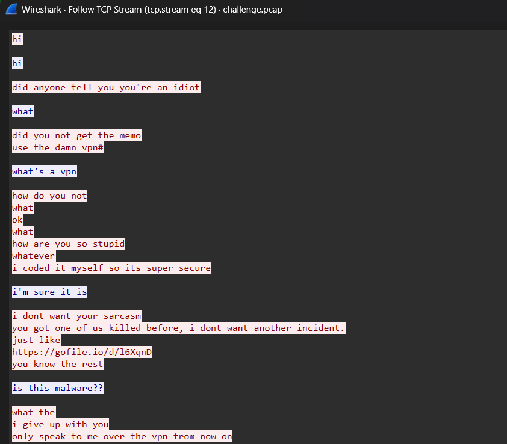
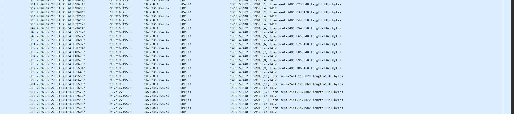
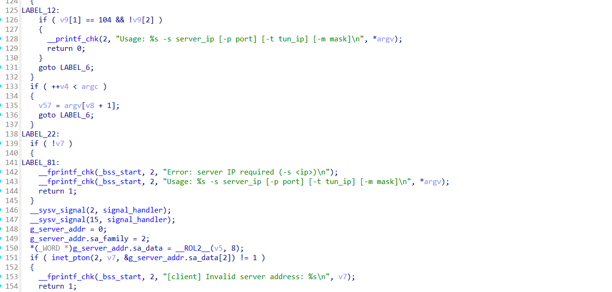
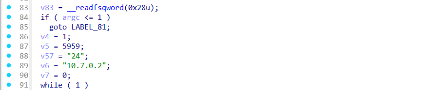
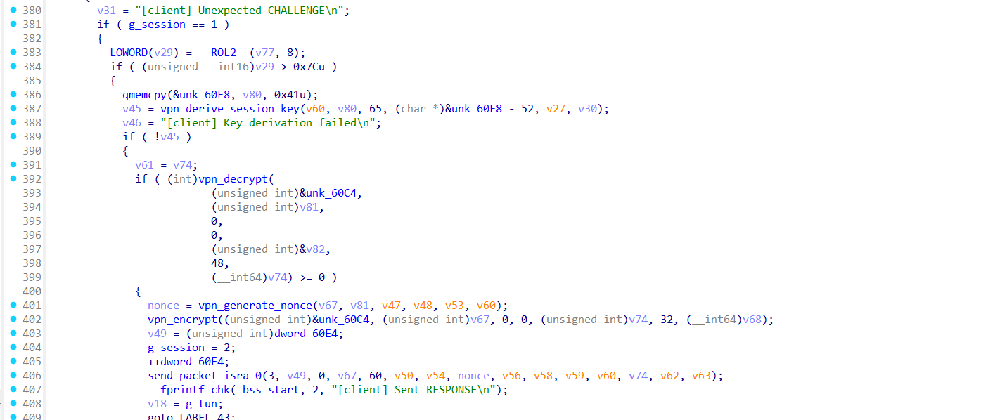

## Misc/Goodvibe

```
operating on good vibes has no real consequences... surely...
```

Bài này cho chúng ta 1 file PCAP, do description ghi nên ta phân tích I/O Graph để xác định scenario của chall này là gì:



Nhìn vào đồ thị thì có 1 khoảng thời gian có lượng packet lớn hơn bình thường rất nhiều, ban đầu mình xác định đây có thể là 1 dạng exfiltrate.

Lướt sơ ở 1 vài packet thì ở TCP stream 12, ta thấy được đoạn hội thoại giữa 2 IP **95.216.195.5** và **167.235.254.47**, nội dung như sau:



Cụ thể là 1 người đã yêu cầu người còn lại phải nói chuyện thông qua 1 VPN tự làm và gửi URL (gofile.io) của VPN đó cho người kia

Sau đó có rất nhiều packet từ 95.216.195.5 đến 167.235.254.47:5959/udp, điều này có nghĩa là client đã kết nối tới server VPN và packet sau đó đi qua đó.



Truy cập vào URL đó ta lấy được file sau

```
file vibepn-client
vibepn-client: ELF 64-bit LSB pie executable, x86-64, version 1 (SYSV), dynamically linked, interpreter /lib64/ld-linux-x86-64.so.2, BuildID[sha1]=d98d0b3beb0e324ce564324d8519f180939185fa, for GNU/Linux 3.2.0, not stripped
```

Sử dụng IDA để reverse xem logic của VPN này như thế nào, tìm tới hàm main:




Ta xác định được rằng, nếu không thay đổi tham số đầu vào, tham số mặc định sẽ là port = 5959, tun ip = 10.7.0.2, mask = 24, đúng với thông tin trong PCAP.

Các bước sau đó lần lượt là: mở TUN - tạo socket UDP - gọi handshake - vào loop xử lý packet



Tại đoạn này, ta xác định được hàm tạo session key là vpn_derive_session_key(), đây là hàm đó:

```c
__int64 __fastcall vpn_derive_session_key(__int64 a1, __int64 a2, __int64 a3, __int64 a4)
{
  int v5; // eax
  __int64 v6; // rcx

  v5 = time(0);
  v6 = a4;
  do
  {
    ++v6;
    v5 = 1664525 * v5 + 1013904223;
    *(_BYTE *)(v6 - 1) = v5;
  }
  while ( v6 != a4 + 32 );
  return 0;
}
```

Hàm này có điểm bất thường là nó không dùng private/public key hay các phương pháp share key bình thường mà lại lấy `time(0)` và chạy LCG `v5 = 1664525 * v5 + 1013904223;`. Nghĩa là session key hoàn toàn phụ thuộc vào timestamp, không phụ thuộc vào key nào khác.

Hàm decrypt nội dung, cơ bản chỉ là AES-256-GCM:
```c
__int64 __fastcall vpn_decrypt(
        __int64 a1,
        __int64 a2,
        __int64 a3,
        __int64 a4,
        __int64 a5,
        unsigned __int64 a6,
        __int64 a7)
{
  __int64 v10; // rax
  __int64 v11; // r14
  unsigned int v12; // r12d
  __int64 v14; // rax
  unsigned __int64 v15; // rbx
  int v16; // r12d
  int v18; // [rsp+14h] [rbp-44h] BYREF
  unsigned __int64 v19; // [rsp+18h] [rbp-40h]

  v19 = __readfsqword(0x28u);
  v10 = EVP_CIPHER_CTX_new();
  if ( !v10 )
    return (unsigned int)-1;
  v11 = v10;
  if ( a6 > 0xF )
  {
    v14 = EVP_aes_256_gcm();
    if ( (unsigned int)EVP_DecryptInit_ex(v11, v14, 0, 0, 0) == 1
      && (unsigned int)EVP_CIPHER_CTX_ctrl(v11, 9, 12, 0) == 1
      && (unsigned int)EVP_DecryptInit_ex(v11, 0, 0, a1, a2) == 1
      && (!a3 || !a4 || (unsigned int)EVP_DecryptUpdate(v11, 0, &v18, a3, (unsigned int)a4) == 1) )
    {
      v15 = a6 - 16;
      if ( (unsigned int)EVP_DecryptUpdate(v11, a7, &v18, a5, (unsigned int)v15) == 1 )
      {
        v16 = v18;
        if ( (unsigned int)EVP_CIPHER_CTX_ctrl(v11, 17, 16, v15 + a5) == 1 )
        {
          if ( (unsigned int)EVP_DecryptFinal_ex(v11, v16 + a7, &v18) == 1 )
          {
            v12 = v18 + v16;
            goto LABEL_4;
          }
          __fprintf_chk(_bss_start, 2, "[crypto] GCM auth tag verification failed\n");
        }
      }
    }
  }
  v12 = -1;
LABEL_4:
  EVP_CIPHER_CTX_free(v11);
  return v12;
}
```

Trong PCAP có sẵn timestamp của packet, ta chỉ cần dùng timestamp của packet làm seed tạo key decrypt:
```c
v = time(0)
repeat 32 times:
    v = 1664525 * v + 1013904223
    key[i] = v & 0xff
```

**=> Flag: dice{y0u_sh0uld_alw@ys_vib3_y0ur_vpns_82bc3}**