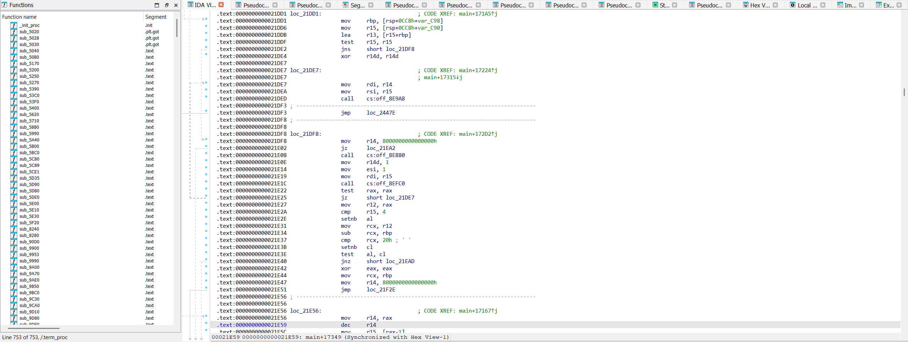
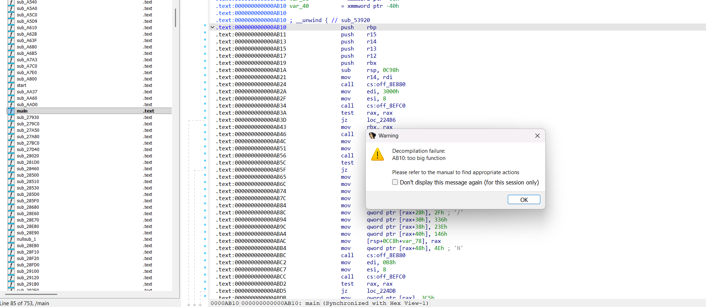
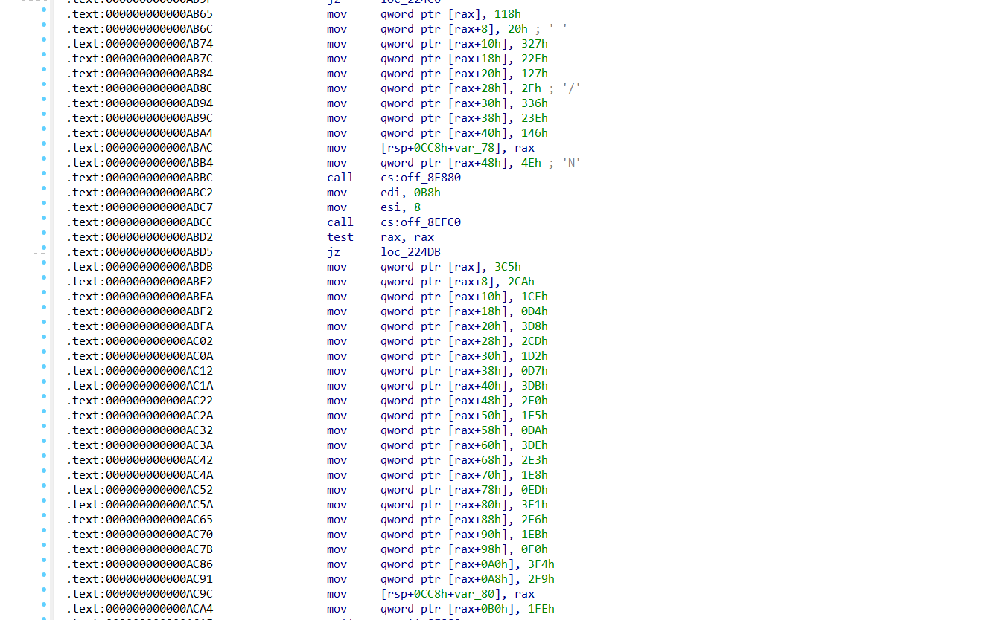
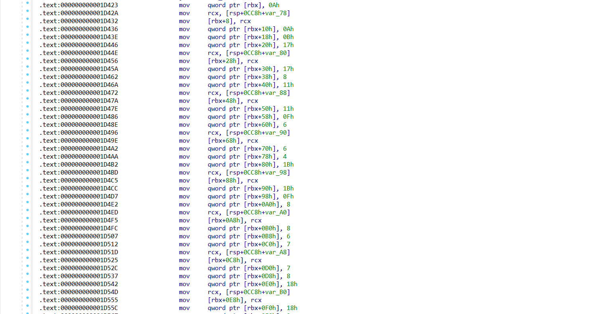
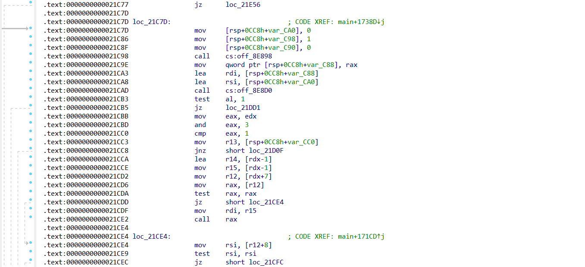

## REV/BEDTIME

Bài này cho ta 1 file binary:
```
file bedtime
bedtime: ELF 64-bit LSB pie executable, x86-64, version 1 (SYSV), static-pie linked, stripped
./bedtime
> helloworld
Error: "bad"
```

File này đang kiểm tra một input đúng/sai, nếu sai thì sẽ in ra bad
Dùng IDA để disassemble:



Ta thấy binary vô cùng rối với rất nhiều hàm, nhiều mảng số được cấp phát động, nhiều record dài,...



Hàm main dài đến mức không thể xem Pseudo code của nó (C) mà chỉ có thể xem bằng IDA

Khi nhìn vào main, thứ nổi bật nhất là nó không check input ngay mà làm:

Dựng các mảng số (rất nhiều):



Tức là, trước hết hàm này cấp phát một vùng nhớ, ghi vào đó một dãy số nguyên, lưu con trỏ của vùng đó vào var_78, var_80,...

Tiếp theo nó gom các mảng này vào một bảng lớn ở rbx



Mỗi block dài 0x20 byte, điều này có nghĩa là main đang dựng một mảng các record/rule, sau đó mới đi lấy input để check



Phần sau vùng 21C7D trở đi mới là: lấy dữ liệu từ đâu đó + lấy dữ liệu từ đâu đó + truyền cho các hàm xử lý/check. Bây giờ, ta cần xác định input đi vào đâu

Sau khi dựng xong bảng rule, main đi vào đoạn lấy input quanh 21C7D.

Có 2 nhánh:
- một nhánh xử lý object/string runtime
- một nhánh lấy buffer thô

Cuối cùng chương trình tạo ra một cấu trúc input gồm:
- con trỏ tới dữ liệu
- độ dài
- vùng cấp phát tương ứng

Sau đó input được đưa sang các hàm xử lý phía dưới.

Sau 1 hồi ngồi soi, mình xác định được 1 số hàm logic chính, tóm tắt như sau:

### sub_27A80
Hàm này parse số nguyên từ chuỗi, từ đó ta biết rằng chương trình kỳ vọng input có thể là danh sách số hoặc ít nhất có parser số để tách token

### sub_28020
Hàm này gọi sub_27A80 lặp đi lặp lại, flow của nó là:
- Gọi sub_27A80 để đọc số đầu tiên
- Cấp phát vector
- Nhét số đầu tiên vào vector
- Tiếp tục gọi sub_27A80 cho tới khi hết input
- Trả ra một danh sách số
=> Hàm này đóng vai trò parse toàn bộ input thành vector số nguyên.

### sub_27D40
Flow của hàm:
- Nhận một cấu trúc chứa danh sách rule
- Tính số lượng phần tử có thể xử lý
- Duyệt từng rule
- Gọi sub_28680 trên từng rule
- Ghi kết quả 0/1 vào một mảng byte kết quả
Hàm này là driver chạy tất cả rule và thu kết quả pass/fail của từng rule

### sub_28680
Phần trong sub_28680 khá rối vì có nhiều nhánh, cấp phát tạm, cleanup.
1. Gom các bit theo một quy luật
Nó lấy nhiều vị trí từ arr, đọc dữ liệu tương ứng và trộn.
2. Dùng XOR / parity / modulo theo tham số k, có nhiều đoạn cho thấy:
- XOR dồn
- Chia bucket/mod với k
- So sánh kết quả

=> Đến đây đã đủ để biết bài là một constraint checker trên bit input

Vì từ flow trên, ta nhận ra, file này có khoảng 400 rule, mỗi rule có một mảng index riêng, mỗi rule có một mảng index riêng, nếu đọc tay từng rule thì sẽ cực lâu

Do đó, ta cần dump dữ liệu rule đã được main dựng xong chứ không phải ngồi gõ lại từng mov

Tiếp đó, ta solve bằng Z3: Ta cần tạo biến cho từng byte hoặc từng bit của input, tạo biến cho từng byte hoặc từng bit của input, thêm constraint ASCII printable / format dice{...}, sau đó solve. Do em lỡ xóa script hôm trước giờ kiếm lại không được nên mọi người thông cảm không có script solve :(

**=> Flag: dice{regularly_runs_like_mad_to_game_of_matches}**